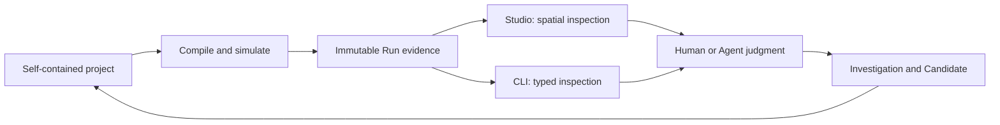

# Integrated Industry Maker

**INM is a local industrial-design workbench for humans and AI Agents.**

It turns a factory from a static diagram into an inspectable system: a
self-contained project, a deterministic simulation, a physical replay, and an
evidence trail for every design decision.

[Quick start](#quick-start) · [Core idea](#the-core-idea) ·
[Memory fab](#why-a-memory-fab) · [Documentation](#documentation) ·
[Development](#development)


Studio is the visual workbench. The `inm` CLI exposes the same typed project and
evidence model to people, scripts, and Agents. An Agent can work entirely from
the CLI, operate Studio through a browser, or move between both without creating
a second source of factory state.

> [!IMPORTANT]
> INM is pre-alpha. Industrial correctness takes priority over backward
> compatibility, so formats and APIs change directly as the model improves.
> Studio is an evidence workbench and visual debugger today, not a drag-and-drop
> factory editor.

## Quick start

Install [Bun](https://bun.sh/), then open the included memory fab:

```bash
git clone https://github.com/luokerenx4/integrated-industry-maker.git
cd integrated-industry-maker
bun install
bun run inm session examples/memory-fab
```

`inm session` starts or reconnects to the project-local Studio, chooses an
available port, and opens the current work item. Checked-in immutable Runs make
the factory inspectable immediately; routine use does not require manual port or
process management.

Use the same project from the command line:

```bash
# Validate the project and its selected industrial model.
bun run inm validate examples/memory-fab

# Read current evidence and the recommended next action.
bun run inm inspect examples/memory-fab

# Bind an immutable Run to exact Factory and Analysis views.
bun run inm observe examples/memory-fab

# Return complete typed state for a script or Agent.
bun run inm inspect examples/memory-fab --section all --json
```

Use `--json` for machine consumers. The versioned envelope contains exact
selections, content hashes, typed evidence, operation effects, and next actions;
there is no need to scrape terminal prose. See the [CLI
reference](docs/CLI.md) and [Agent CLI
contract](docs/design/agent-cli-contract.md) for the complete interface.

### Choose your route

| I want to… | Start with… |
| --- | --- |
| Explore a factory visually | `bun run inm session examples/memory-fab` and the [Studio guide](docs/design/studio-debugger.md) |
| Operate INM from an Agent or script | `bun run inm inspect examples/memory-fab --json` and the [Agent CLI contract](docs/design/agent-cli-contract.md) |
| Learn the file format on a smaller factory | [Ironworks](examples/ironworks/README.md) |
| Create a self-contained factory | [Project format](docs/PROJECT_FORMAT.md) and [project boundaries](docs/design/project-boundaries.md) |
| Change the engine | [Architecture](docs/ARCHITECTURE.md), then [AGENTS.md](AGENTS.md) |

If Studio does not open, use the lifecycle and diagnosis commands in
[Development operations](docs/design/development-operations.md).

## The core idea

A factory design is not accepted because an optimizer produced a high score.
INM compiles the model, simulates it, attributes loss, and compares explicit
alternatives. A human or reasoning Agent still owns the hypothesis, trade-offs,
and commissioning decision.



The working loop is deliberately explicit:

1. Select the Blueprint, Production Plan, Scenario, and Objective.
2. Run or reopen compatible immutable evidence.
3. Inspect spatial replay, causal losses, material state, and lot chronology.
4. Record an observation and a falsifiable hypothesis.
5. Author the smallest Candidate that tests it.
6. Compare before and after, then **keep**, **revise**, **defer**, or **discard**.

That boundary is defined by [observation-led
design](docs/design/observation-led-design.md). [Industrial
Investigations](docs/design/industrial-investigations.md) retain the reasoning
chain, while the [Operator Workbench](docs/design/operator-workbench.md) keeps
the current status and next action consistent across Studio and the CLI.

### What the project models today

- typed Resources, Devices, Processes, routes, operating modes, and project-local
  TypeScript Device runtimes;
- physical layouts, belts, sorters, buffers, station fleets, power grids, and
  facility utilities;
- tracked lots, re-entrant work centers, batch and release control, dispatch,
  setup, maintenance, inspection, rework, scrap, quality, and lineage;
- Production Plans, delivery contracts, Objectives, locked Benchmarks,
  Candidates, causal diagnostics, and immutable Runs.

INM does not promise stable file compatibility, automatic commissioning, or a
black-box optimizer that replaces industrial judgment.

## Why a memory fab

The [re-entrant DRAM memory fab](examples/memory-fab/README.md) is INM's
north-star project. Semiconductor manufacturing forces the model to confront
shared equipment, repeated visits to the same work centers, named lots, batch
formation, setup, maintenance, yield, quality excursions, rework, utilities,
WIP, due dates, and product lineage at the same time. An abstraction that
remains useful here should transfer to simpler factories without changing its
foundations.

All timing, defect, yield, capacity, and cost values are synthetic. The example
is an industrial abstraction, not a proprietary DRAM recipe or production
claim. Read the [memory-fab model and current
evidence](examples/memory-fab/README.md), or begin with
[Ironworks](examples/ironworks/README.md) for a smaller schema reference.

## Projects are self-contained

A workspace may discover many projects, but it owns no shared factory assets.
Each project carries its own model, controls, evidence, and presentation assets.
Reusing an asset means copying it into another project; the copies then evolve
and hash independently.

```text
my-factory/
  inm.json
  assets/{resources,devices}/
  processes/ and routes/
  worlds/ and blueprints/
  production-plans/ scenarios/ objectives/
  benchmarks/ and design-programs/
  investigations/ candidates/ candidate-reviews/
  runs/ and tests/
```

The canonical directory layout, schemas, discovery rules, and examples live in
[Project format](docs/PROJECT_FORMAT.md).

## Documentation

Read by task rather than walking the entire `docs/` tree:

- **Run and operate INM:** [CLI reference](docs/CLI.md), [Studio visual
  debugger](docs/design/studio-debugger.md), and [Development
  operations](docs/design/development-operations.md).
- **Use INM as an Agent:** [Agent CLI
  contract](docs/design/agent-cli-contract.md) and [Operation
  workbench](docs/design/operation-workbench.md).
- **Design and review a factory:** [Observation-led
  design](docs/design/observation-led-design.md), [Industrial
  Investigations](docs/design/industrial-investigations.md), and the [Experiment
  workbench](docs/design/experiment-workbench.md).
- **Understand the industrial model:** [Material
  contracts](docs/design/material-contracts.md), [Product
  routes](docs/design/product-routes.md), [Work-center
  dispatch](docs/design/work-center-dispatch.md), and
  [logistics](docs/design/logistics.md).
- **Build a project or extend INM:** [Project format](docs/PROJECT_FORMAT.md),
  [Architecture](docs/ARCHITECTURE.md), and the [contributor guide](AGENTS.md).
- **Follow implementation work:** [PLANS.md](PLANS.md) indexes active and
  completed records under [`plans/`](plans/).

The complete subsystem map is in the [contributor guide](AGENTS.md#design-map).

## Development

The repository is a Bun workspace with three packages:

- [`inm-core`](packages/inm-core/) owns compilation, simulation, evaluation,
  evidence, and operation semantics;
- [`inm-cli`](packages/inm-cli/) projects the same model as a typed CLI;
- [`inm-studio`](packages/inm-studio/) provides the local visual workbench.

Runnable, self-contained projects live under [`examples/`](examples/).

```bash
# Fast feedback while iterating.
bun run check:fast

# Checkpoint: docs, types, package tests, and project fixtures.
bun run test
```

Read [AGENTS.md](AGENTS.md) before a substantial change. Cross-package or
model-level work follows the workflow in [PLANS.md](PLANS.md); a local
documentation fix does not require a plan.
