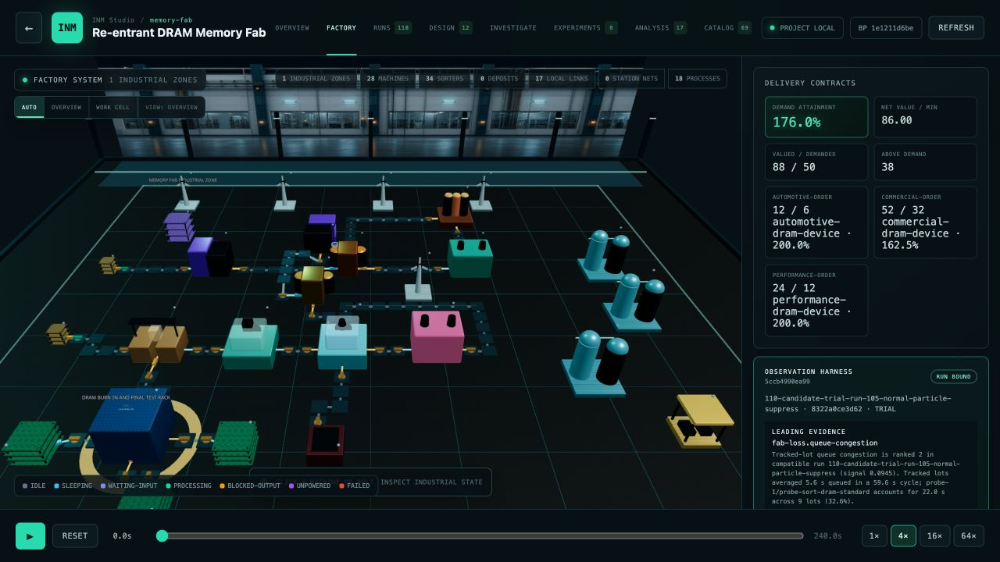
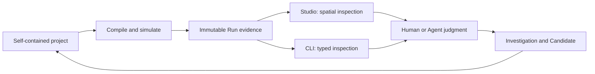

# Integrated Industry Maker

**INM is a local workbench where humans and AI Agents design, simulate,
inspect, and improve industrial production systems together.**

> A factory is a self-contained project. A Blueprint is its physical and
> operational configuration. A Run is immutable evidence.

[Start in two minutes](#start-in-two-minutes) ·
[Understand the model](#how-inm-works) ·
[See the memory fab](#the-memory-fab) ·
[Find documentation](#documentation-by-task) ·
[Contribute](#development)



INM treats factory design as an inspectable, versioned workflow. Each project
owns its equipment, resources, processes, layout, operating plan, test
conditions, objectives, and evidence. Studio makes the factory visible; the
`inm` CLI exposes the same typed state to people, scripts, and Agents.

INM is not an autonomous factory generator. The engine compiles, simulates,
attributes losses, and compares explicitly bounded alternatives. A human or
reasoning Agent still owns the hypothesis, trade-offs, and commissioning
decision. That boundary is the core of
[observation-led design](docs/design/observation-led-design.md).

> [!IMPORTANT]
> INM is pre-alpha. Industrial correctness takes priority over backward
> compatibility, so formats and APIs change directly as the model improves.
> Studio is an evidence workbench and visual debugger today, not a
> drag-and-drop factory editor.

## What works today

| Capability | Current boundary | Read more |
| --- | --- | --- |
| **Model a factory** | Self-contained projects with typed assets, physical Blueprints, Production Plans, Scenarios, and Objectives | [Project format](docs/PROJECT_FORMAT.md) |
| **Run it** | Deterministic compilation, simulation, immutable Runs, replay, and locked comparison | [Simulation runtime](docs/design/simulation-runtime.md) |
| **Reason about it** | Causal loss attribution, spatial observation, Investigations, Candidates, and bounded Design Programs | [Observation-led design](docs/design/observation-led-design.md) |
| **Operate it** | One Core model projected through Studio for visual work and a typed CLI for humans, scripts, and Agents | [Operator Workbench](docs/design/operator-workbench.md) |

INM deliberately does not promise stable file compatibility, automatic factory
commissioning, or a black-box optimizer that replaces industrial judgment.

## Start in two minutes

Prerequisite: [Bun](https://bun.sh/).

```bash
git clone https://github.com/luokerenx4/integrated-industry-maker.git
cd integrated-industry-maker
bun install
bun run inm session examples/memory-fab
```

`inm session` starts or reconnects to the project-local Studio, chooses an
available port, and opens the current work item. It is the shortest path to the
re-entrant DRAM memory fab; no manual process or port management is required.

### Use the same project from the CLI

```bash
# Compile and validate the selected factory.
bun run inm validate examples/memory-fab

# Read current evidence, diagnostics, and the recommended next action.
bun run inm inspect examples/memory-fab

# Bind the current immutable Run to exact Factory and Analysis views.
bun run inm observe examples/memory-fab

# Return the complete state as a versioned machine-readable envelope.
bun run inm inspect examples/memory-fab --section all --json
```

Use `--json` for scripts and Agents. The envelope includes exact selections,
content hashes, typed evidence, operation effects, and next actions, so a
consumer never needs to scrape terminal prose. The full contract lives in the
[CLI reference](docs/CLI.md) and
[Agent CLI contract](docs/design/agent-cli-contract.md).

### Pick the right first step

| If you want to… | Start here |
| --- | --- |
| Explore the factory visually | `bun run inm session examples/memory-fab` and the [Studio guide](docs/design/studio-debugger.md) |
| Operate INM from an Agent or script | `bun run inm inspect examples/memory-fab --json` and the [Agent CLI contract](docs/design/agent-cli-contract.md) |
| Discover every machine-facing command and schema | `bun run inm help --json` and `bun run inm schema --json` |
| Learn with a smaller project | [Ironworks](examples/ironworks/README.md) |
| Create a self-contained factory | [Project format](docs/PROJECT_FORMAT.md) and [project boundaries](docs/design/project-boundaries.md) |
| Change the engine | [Architecture](docs/ARCHITECTURE.md), then [AGENTS.md](AGENTS.md) |

## How INM works

Studio and the CLI are two interfaces over one Core project and one evidence
model. An Agent can remain in the CLI, operate Studio through a browser, or move
between both without creating a second source of factory state.



The main project concepts are explicit rather than hidden behind a single
optimizer:

| Concept | What it represents | Contract |
| --- | --- | --- |
| **Project** | One self-contained factory and all of its evidence | [Project boundaries](docs/design/project-boundaries.md) |
| **Blueprint** | Physical equipment, connections, layout, and control policy | [Blueprint comparison](docs/design/blueprint-comparison.md) |
| **Production Plan** | Authored lot starts, release intent, and operating commitments | [Production Plans](docs/design/production-plans.md) |
| **Scenario** | One exact set of operating conditions and disturbances | [Project format](docs/PROJECT_FORMAT.md) |
| **Objective** | Delivery commitments, WIP scope, cost, quality, and other judgment terms | [Delivery contracts](docs/design/delivery-contracts.md) |
| **Run** | Immutable, hash-bound simulation evidence | [Simulation runtime](docs/design/simulation-runtime.md) |
| **Investigation** | Persistent observations, hypotheses, evidence anchors, and decisions | [Industrial Investigations](docs/design/industrial-investigations.md) |
| **Candidate** | One exact, reviewable change set against a known Blueprint | [Experiment workbench](docs/design/experiment-workbench.md) |
| **Design Program** | A bounded, project-authored proposal and evaluation instrument | [Design Programs](docs/design/design-programs.md) |

### The design loop

1. Select the exact Blueprint, Production Plan, Scenario, and Objective.
2. Run or reopen compatible immutable evidence.
3. Inspect the spatial replay, physical-loss attribution, material state, and
   lot chronology.
4. Record an observation and a falsifiable hypothesis.
5. Author the smallest Candidate or Production Plan change that tests it.
6. Compare locked before/after evidence, then explicitly **keep**, **revise**,
   **defer**, or **discard** the change.

[Industrial Investigations](docs/design/industrial-investigations.md) preserve
that reasoning chain. The [Operator Workbench](docs/design/operator-workbench.md)
keeps current status and the next action consistent across Studio and the CLI.

## The memory fab

The [re-entrant DRAM memory fab](examples/memory-fab/README.md) is INM's
north-star project. Modern semiconductor manufacturing forces the model to
confront shared work centers, re-entrant routes, named lots, batch formation,
setup, maintenance, quality excursions, rework, utilities, WIP, due dates, and
source-lot lineage. An abstraction that remains useful here should transfer to
simpler factories without changing its foundations.

The project currently exercises:

- project-local Resource and Device packages, configurable Processes, buffers,
  ports, operating modes, and TypeScript Device runtimes
  ([material contracts](docs/design/material-contracts.md),
  [production modes](docs/design/production-modes.md));
- multi-zone layouts, explicit sorters and belts, station fleets, power grids,
  facility utilities, and spatial replay
  ([logistics](docs/design/logistics.md),
  [facility utilities](docs/design/fab-facility-utilities.md));
- tracked lots, batch and release control, dispatch, setup, maintenance,
  inspection, rework, scrap, quality, and product lineage
  ([product routes](docs/design/product-routes.md),
  [quality flow](docs/design/quality-flow.md));
- Production Plans, delivery contracts, Objectives, locked Benchmarks,
  Candidates, immutable Runs, causal diagnostics, and loss attribution
  ([Production Plans](docs/design/production-plans.md),
  [fab loss attribution](docs/design/fab-loss-attribution.md)).

The memory-fab data is a synthetic industrial model, not a proprietary DRAM
recipe or production claim. [Ironworks](examples/ironworks/README.md) is the
smaller, faster reference for learning schemas and testing engine changes.

## Projects are self-contained

A workspace may discover many projects, but it owns no shared factory assets.
Every project is a complete directory. Reuse means copying an asset package;
the copies then evolve and hash independently.

```text
my-factory/
  inm.json
  assets/{resources,devices}/
  processes/
  product-routes/
  worlds/
  blueprints/
  production-plans/
  scenarios/
  objectives/
  benchmarks/
  design-programs/
  candidates/
  candidate-reviews/
  investigations/
  runs/
  tests/
```

The exact schemas and discovery rules live in
[Project format](docs/PROJECT_FORMAT.md).

## Documentation by task

| Goal | Read in this order |
| --- | --- |
| Use Studio and the CLI | [CLI](docs/CLI.md) → [Studio](docs/design/studio-debugger.md) → [Development operations](docs/design/development-operations.md) |
| Design and review a factory | [Observation-led design](docs/design/observation-led-design.md) → [Industrial Investigations](docs/design/industrial-investigations.md) → [Experiment workbench](docs/design/experiment-workbench.md) |
| Understand simulation evidence | [Simulation runtime](docs/design/simulation-runtime.md) → [Fab loss attribution](docs/design/fab-loss-attribution.md) → [Blueprint comparison](docs/design/blueprint-comparison.md) |
| Understand the industrial model | [Material contracts](docs/design/material-contracts.md) → [Product routes](docs/design/product-routes.md) → [Work-center dispatch](docs/design/work-center-dispatch.md) → [Logistics](docs/design/logistics.md) |
| Build or inspect a complete project | [Project format](docs/PROJECT_FORMAT.md) → [Project boundaries](docs/design/project-boundaries.md) → [Architecture](docs/ARCHITECTURE.md) |
| Follow current implementation work | [Plan index](PLANS.md) → the linked record under [`plans/`](plans/) |
| Contribute to the engine | [Architecture](docs/ARCHITECTURE.md) → [Contributor guide](AGENTS.md) → [Documentation system](docs/design/documentation-system.md) |

The complete subsystem index lives in the
[contributor guide](AGENTS.md#design-map). Active and completed implementation
work is indexed in [PLANS.md](PLANS.md).

## Development

The repository contains three workspace packages:

- [`inm-core`](packages/inm-core/) owns compilation, simulation, evaluation,
  evidence, and operation semantics.
- [`inm-cli`](packages/inm-cli/) projects that model as a typed command-line
  interface.
- [`inm-studio`](packages/inm-studio/) provides the local visual workbench.

Runnable, self-contained projects live under [`examples/`](examples/).

```bash
# Fast local feedback while iterating.
bun run check:fast

# Full checkpoint: docs, types, package tests, and project fixtures.
bun run test
```

Read [AGENTS.md](AGENTS.md) before a substantial change. Cross-package or
model-level work follows the plan workflow under [`plans/`](plans/); a local
documentation fix does not need its own plan.
